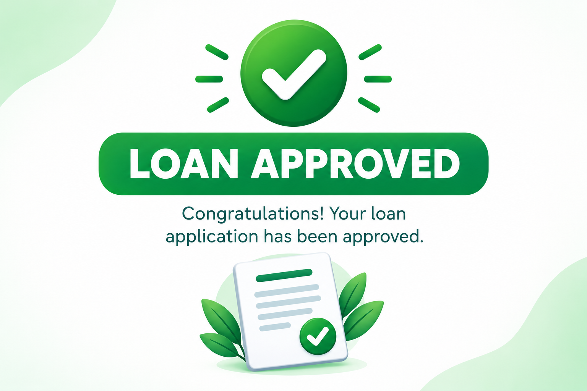
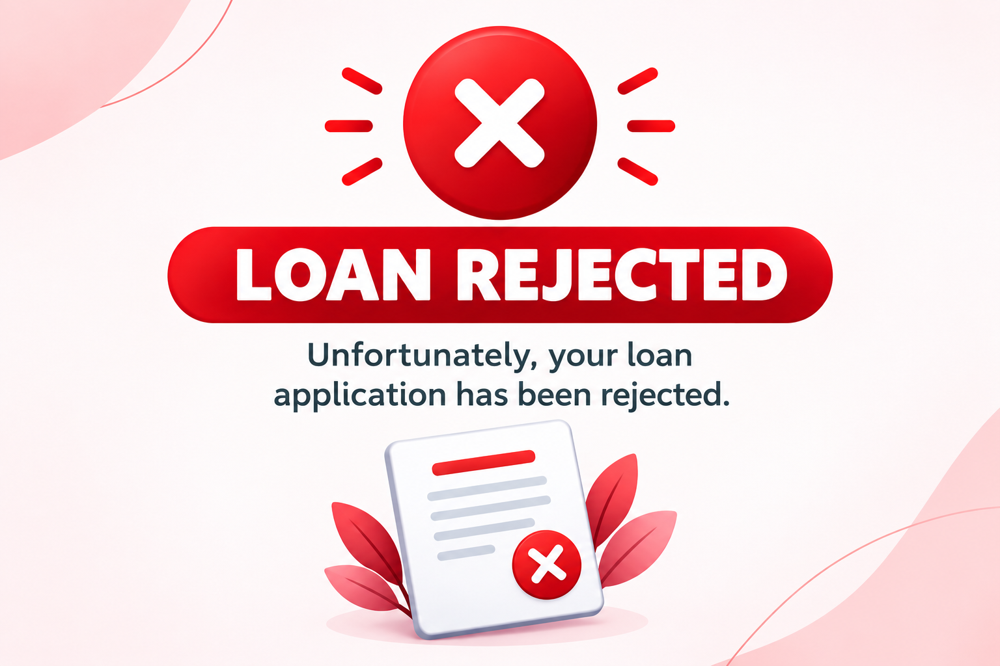

# 💳 Loan Approval Prediction

A supervised machine learning project developed as part of the **Microsoft Nirmaan Program**.

This project predicts whether a loan application is likely to be **Approved or Rejected** based on applicant and loan-related information. The trained machine learning model is integrated into a **Streamlit web application** for interactive predictions.

## 🚀 Live Demo

**[🌐 Open Loan Approval Prediction App](https://loan-approval-prediction-l54zeuzpy5jiuywy8rjwzw.streamlit.app/)**

## 📌 Project Highlights

* **Problem Type:** Binary Classification
* **Target:** Loan Approval Status
* **Dataset:** Loan applicant and financial information
* **Classes:** Approved / Rejected
* **Test Samples:** 854
* **Model:** Machine Learning Classification
* **Test Accuracy:** **98%**
* **Evaluation:** Precision, Recall, F1-Score and Confusion Matrix
* **Deployment:** Streamlit
* **Model:** Saved as `.pkl`

## 🔄 Project Workflow

**Data → Data Cleaning → Preprocessing → Train/Test Split → Model Training → Evaluation → Model Saving → Streamlit Prediction**

## 📊 Model Performance

| Metric       |    Score |
| ------------ | -------: |
| Accuracy     |  **98%** |
| Precision    | **0.98** |
| Recall       | **0.98** |
| F1-Score     | **0.98** |
| Test Samples |  **854** |

### Classification Performance

| Class | Precision | Recall | F1-Score | Support |
| ----- | --------: | -----: | -------: | ------: |
| 0     |      0.98 |   0.99 |     0.99 |     531 |
| 1     |      0.98 |   0.97 |     0.97 |     323 |

> **Note:** These results are based on the evaluated test set of 854 samples and should not be interpreted as a guarantee of performance on future loan applications.

## 🌐 Application

The Streamlit application allows users to enter applicant and loan details and receive a predicted loan approval status.

**Prediction Classes:**

* ✅ Loan Approved
* ❌ Loan Rejected


### Prediction Outputs





## 🛠️ Technologies

**Python · Pandas · NumPy · Scikit-learn · Matplotlib · Seaborn · Streamlit · Git & GitHub**

## 📁 Project Structure

```text
loan-approval-prediction/
├── data/
│   └── loan_approval.csv
├── model/
│   └── loan_model.pkl
├── screenshots/
│   ├── approved.png
│   ├── rejected.png
│   └── streamlit_app.png
├── train.ipynb
├── app.py
├── requirements.txt
└── README.md
```

## 🎓 Microsoft Nirmaan Program

This project was developed as part of the **Microsoft Nirmaan Program** to gain practical experience in supervised machine learning, classification, model evaluation, deployment, and GitHub-based project development.

## 🚀 Future Improvements

* Compare multiple classification algorithms
* Add cross-validation
* Improve model performance
* Add prediction probability
* Enhance the Streamlit interface
* Deploy the application online

## 👨‍💻 Author

**Samarth Kokate**
B.Tech Computer Science Engineering — Data Science

GitHub: **[@s56874](https://github.com/s56874)**

---

⭐ If you find this project useful, consider giving the repository a star.
